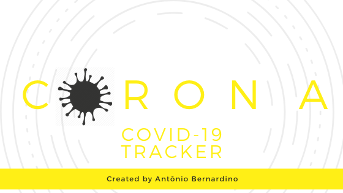
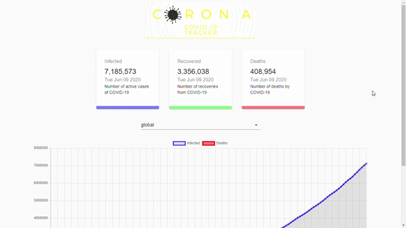

<h1 align="center">
    
</h1>


<p align="center">
  
  <a href="https://github.com/Tonybsilva-dev/CoronaData/commits/master">
  
  </a>
  
  
  <a href="https://github.com/tonybsilva-dev/CoronaData/stargazers">
    
  </a>
  	
  <a href="https://twitter.com/tonybsilvaaa">
    
  </a>

</p>
<h3 align="center"> https://tonybsilva-dev.github.io/CoronaData/ </h3>
<h1>CoronaData</h1>
<span>An application to chart the progress of COVID-19 in the world</span>

<h1 align="center">
    
</h1>

## Starting the application:

<h6>Project</h6>

```
yarn start # Inicializa o React

```

## Ferramentas Utilizadas:
<ul>
  <li>React</li>
  <li>Yarn</li>
</ul>

## :memo: License

Esse projeto está sob a licença MIT. Veja o arquivo [LICENSE](LICENSE.md) para mais detalhes.

## Contribua para o projeto 😉

1. Faça um **fork** do projeto.
2. Crie uma nova branch com as suas alterações: `git checkout -b my-feature`
3. Salve as alterações e crie uma mensagem de commit contando o que você fez: `git commit -m "feature: My new feature"`
4. Envie as suas alterações: `git push origin my-feature`
> Caso tenha alguma dúvida confira este [guia de como contribuir no GitHub](https://github.com/firstcontributions/first-contributions)


Antônio Bernardino 👋🏽 [Entre em contato!](https://www.linkedin.com/in/tony-silva/)
